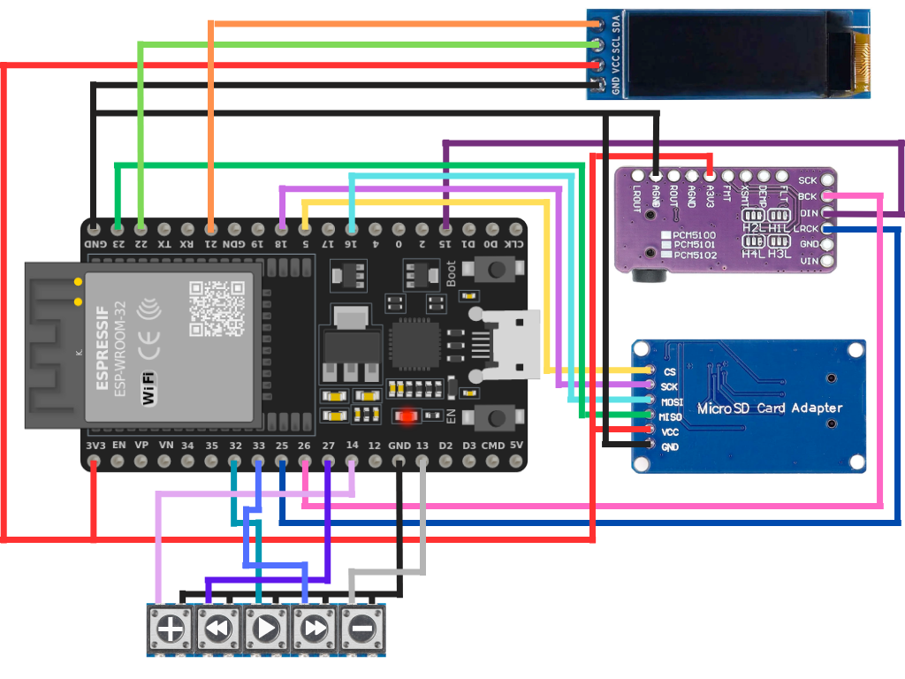

<div align="center">


# P3R Music Player - Dark Hour Edition

**A Persona 3 Reload–inspired MP3 player built on ESP32 with I2S DAC, OLED display, and SD card playback.**


</div>

---

## Table of Contents

1. [Overview](#overview)
2. [Features](#features)
3. [System Architecture](#system-architecture)
4. [Hardware Requirements](#hardware-requirements)
5. [Wiring Guide](#wiring-guide)
6. [SD Card Setup](#sd-card-setup)
7. [Software Prerequisites](#software-prerequisites)
8. [Build & Flash Instructions](#build--flash-instructions)
9. [Configuration Reference](#configuration-reference)
10. [Code Architecture](#code-architecture)
11. [Serial Monitor Output](#serial-monitor-output)
12. [Troubleshooting](#troubleshooting)
13. [Notes & Limitations](#notes--limitations)

---

## Overview

The **P3R Music Player** is a standalone embedded MP3 player running on an **ESP32 microcontroller**. It streams MP3 files from a MicroSD card through an **I2S DAC** to a speaker, while rendering track title and playback progress on a **128×32 OLED display**. Five physical buttons provide full transport and volume control.

The project is a love letter to the **Persona 3 Reload** OST and the aesthetic of the Gekkoukan High Dark Hour. The boot screen displays `"Dark Hour ready"` as a nod to the game.

---

## Features

| Feature | Detail |
|---|---|
| MP3 Playback | Hardware-accelerated decoding via `ESP32-audioI2S` |
| I2S Audio Output | Direct digital audio to PCM5102A stereo DAC |
| SD Card Source | FAT32 MicroSD; auto-discovers all `.mp3` files in `/music` |
| Track Navigation | Next / Previous with automatic wrap-around |
| Play / Pause | Toggle with state preservation |
| Volume Control | 22-step volume scale (0–21), persistent across tracks |
| Auto-advance | Seamlessly plays next track on end-of-file |
| OLED Display | Track title (2-line with truncation) + `mm:ss / mm:ss` progress |
| Hardware Debounce | Software debounce on all 5 buttons (35 ms threshold) |
| Serial Logging | Structured debug output at 115200 baud |

---

## System Architecture



---

## Hardware Requirements

| Component | Specification | Notes |
|---|---|---|
| Microcontroller | ESP32 DevKit (any variant) | 38-pin or 30-pin boards both work |
| MicroSD Module | SPI interface, FAT32 | Use a **3.3 V–safe** module; cheap 5 V modules may damage the ESP32 |
| DAC Module | PCM5102A breakout board (I2S, 32-bit stereo) | Most breakout boards include a 3.5 mm headphone jack and pre-wired control pins — **3.3 V only** |
| Headphones / Output | Wired headphones or 3.5 mm jack | Plug directly into the PCM5102A breakout board's onboard jack |
| OLED Display | 128×32, I2C, SSD1306 controller | I2C address `0x3C` (most common) |
| Push Buttons | Tactile momentary switches × 5 | Wired to GPIO and GND; uses internal pull-ups |
| MicroSD Card | ≤ 32 GB, FAT32 formatted | SDHC cards up to 32 GB are the most reliable |
| Power Supply | 5 V via USB or external | Ensure ≥ 500 mA for stable SD + DAC operation |

---

## Wiring Guide

### MicroSD Card Module (SPI)

```
ESP32 DevKit          MicroSD Module
─────────────         ──────────────
GPIO  5  (CS)   ───►  CS
GPIO 18  (SCK)  ───►  SCK
GPIO 19  (MISO) ◄───  MISO
GPIO 23  (MOSI) ───►  MOSI
3.3 V           ───►  VCC      ← use 3.3 V, NOT 5 V
GND             ───►  GND
```

> **Warning:** Many inexpensive MicroSD breakout boards are designed for 5 V systems. Feeding 5 V into an ESP32 GPIO **will damage it**. Verify your module is 3.3 V–compatible or add a level shifter.

---

### I2S DAC — PCM5102A

The PCM5102A is a high-quality 32-bit stereo I2S DAC with a line-level output. It does **not** include a power amplifier, but its output level is sufficient to drive **wired headphones directly** through a 3.5 mm jack.

```
ESP32 DevKit          PCM5102A Breakout
─────────────         ─────────────────
GPIO 26  (BCLK) ───►  BCK      (bit clock)
GPIO 25  (LRC)  ───►  LRCK     (word-select / left-right clock)
GPIO 15  (DIN)  ───►  DIN      (I2S data)
3.3 V           ───►  A3V3     ← 3.3 V ONLY — do NOT use 5 V
GND             ───►  AGND
```

Then plug your wired headphones into the board's 3.5 mm jack.

> **Note:** Most breakout boards already tie `SCK` low (PLL mode), `XSMT` high (unmuted), and `FMT/FLT/DEMP` low. If your board exposes those pins and audio is muted, verify `XSMT` is high.

---

### OLED Display (128×32, I2C, SSD1306)

```
ESP32 DevKit          SSD1306 OLED
─────────────         ────────────
GPIO 21  (SDA)  ───►  SDA
GPIO 22  (SCL)  ───►  SCL
3.3 V           ───►  VCC
GND             ───►  GND
```

---

### Buttons (active-low, internal pull-up)

All buttons are wired between the listed GPIO and **GND**. The firmware configures `INPUT_PULLUP` on each pin — no external resistors are needed.

```
ESP32 DevKit          Button
─────────────         ──────
GPIO 32         ───┤Play/Pause├─── GND
GPIO 33         ───┤   Next   ├─── GND
GPIO 27         ───┤  Previous├─── GND
GPIO 14         ───┤  Vol  +  ├─── GND
GPIO 13         ───┤  Vol  −  ├─── GND
```

---

### Complete Pin Reference

| Signal | GPIO | Direction | Protocol |
|---|:---:|:---:|---|
| SD CS | 5 | OUT | SPI |
| SD SCK | 18 | OUT | SPI |
| SD MISO | 19 | IN | SPI |
| SD MOSI | 23 | OUT | SPI |
| I2S BCLK | 26 | OUT | I2S |
| I2S LRC/WS | 25 | OUT | I2S |
| I2S DIN | 15 | OUT | I2S |
| OLED SDA | 21 | BIDIR | I2C |
| OLED SCL | 22 | OUT | I2C |
| BTN Play/Pause | 32 | IN | GPIO |
| BTN Next | 33 | IN | GPIO |
| BTN Previous | 27 | IN | GPIO |
| BTN Vol+ | 14 | IN | GPIO |
| BTN Vol− | 13 | IN | GPIO |

---

## SD Card Setup

1. Format the MicroSD card as **FAT32**.
2. Create a folder named exactly `/music` at the root of the card.
3. Copy your MP3 files into `/music`.

```
SD Card (root)
└── music/
    ├── 001_- Mass Destruction.mp3
    ├── 002_- Iwatodai Dorm.mp3
    ├── 003_- Memories of You.mp3
    └── ...
```

> **Tip:** Files are sorted alphabetically before playback. Prefix filenames with a zero-padded track number (e.g., `001_`, `002_`) to control play order.

> **Note:** Only files with a `.mp3` extension (case-insensitive) inside `/music` are recognised. Subfolders and other audio formats are not currently scanned.

---

## Software Prerequisites

### Arduino IDE

Install **Arduino IDE 2.x** from [arduino.cc](https://www.arduino.cc/en/software).

### ESP32 Board Package

1. Open Arduino IDE → **File → Preferences**.
2. Add the following URL to *Additional Board Manager URLs*:
   ```
   https://raw.githubusercontent.com/espressif/arduino-esp32/gh-pages/package_esp32_index.json
   ```
3. Go to **Tools → Board → Boards Manager**.
4. Search for `esp32` and install **esp32 by Espressif Systems** (version 2.x or later).

### Required Libraries

Install all three from **Tools → Manage Libraries**:

| Library | Purpose |
|---|---|
| `ESP32-audioI2S` by schreibfaul1 | MP3 decoding and I2S audio streaming |
| `Adafruit GFX Library` | Base graphics primitives for OLED |
| `Adafruit SSD1306` | SSD1306 OLED driver |

---

## Build & Flash Instructions

1. Clone or download this repository.
2. Open [P3Rmp3Player.ino](P3Rmp3Player.ino) in Arduino IDE.
3. Select your board:
   - **Tools → Board → ESP32 Arduino → ESP32 Dev Module** (or your specific variant).
4. Set upload speed:
   - **Tools → Upload Speed → 921600** (recommended for faster uploads).
5. Select the serial port:
   - **Tools → Port → [your COM / tty port]**
6. Click **Upload** (→).
7. Open **Tools → Serial Monitor** at **115200 baud** to observe boot and runtime logs.

---

## Configuration Reference

All tunable constants are declared in named C++ `namespace` blocks at the top of [P3Rmp3Player.ino](P3Rmp3Player.ino). No magic numbers exist anywhere else in the codebase.

### `Pins` namespace

| Constant | Default | Description |
|---|:---:|---|
| `SD_CS` | `5` | SPI chip-select for MicroSD |
| `SD_SCK` | `18` | SPI clock |
| `SD_MISO` | `19` | SPI MISO |
| `SD_MOSI` | `23` | SPI MOSI |
| `I2S_BCLK` | `26` | I2S bit clock |
| `I2S_LRC` | `25` | I2S word-select / left-right clock |
| `I2S_DOUT` | `15` | I2S data output to DAC |
| `BTN_PLAY_PAUSE` | `32` | Play / Pause button |
| `BTN_NEXT` | `33` | Next track button |
| `BTN_PREV` | `27` | Previous track button |
| `BTN_VOL_UP` | `14` | Volume increase button |
| `BTN_VOL_DOWN` | `13` | Volume decrease button |
| `OLED_SDA` | `21` | I2C data line for OLED |
| `OLED_SCL` | `22` | I2C clock line for OLED |

### `PlayerConfig` namespace

| Constant | Default | Description |
|---|:---:|---|
| `MUSIC_DIR` | `"/music"` | Root path scanned for MP3 files on the SD card |
| `DEBOUNCE_MS` | `35` | Button debounce window in milliseconds |
| `START_VOLUME` | `12` | Initial volume level on boot (range 0–21) |
| `MIN_VOLUME` | `0` | Minimum volume level |
| `MAX_VOLUME` | `21` | Maximum volume level |
| `DISPLAY_REFRESH_MS` | `250` | OLED refresh interval in milliseconds |

### `DisplayConfig` namespace

| Constant | Default | Description |
|---|:---:|---|
| `WIDTH` | `128` | OLED panel width in pixels |
| `HEIGHT` | `32` | OLED panel height in pixels |
| `RESET_PIN` | `-1` | Reset pin (`-1` = shared with MCU reset) |
| `I2C_ADDRESS` | `0x3C` | I2C address of the SSD1306 controller |
| `CHARS_PER_LINE` | `21` | Maximum characters per display line at text size 1 |

---

## Code Architecture

The firmware is structured around three collaborating concerns: **audio decoding**, **display rendering**, and **input handling** — each encapsulated to remain independent and testable.

```
P3Rmp3Player.ino
│
├── namespace Pins          — All GPIO assignments (single source of truth)
├── namespace PlayerConfig  — Runtime behaviour constants
├── namespace DisplayConfig — OLED geometry constants
│
├── struct DebouncedButton  — Reusable GPIO button with software debounce
│   ├── begin()             — Configures INPUT_PULLUP, seeds state
│   └── pressed()           — Returns true on falling-edge, debounced
│
├── Audio audio             — ESP32-audioI2S instance (MP3 decode + I2S DMA)
├── Adafruit_SSD1306 display— OLED driver instance
├── std::vector<String> tracks — Sorted list of discovered MP3 paths
│
├── Helper functions
│   ├── basenameNoExtension() — Extracts display-friendly song name from path
│   ├── pad2()              — Zero-pads integers to 2 digits
│   ├── formatMmSs()        — Converts seconds → "mm:ss" string
│   └── fitLine()           — Truncates a string with "…" to fit display width
│
├── Core playback functions
│   ├── loadTrackList()     — Scans /music, filters .mp3, sorts alphabetically
│   ├── playTrack(index)    — Stops current song, starts new, wraps index
│   ├── playNextTrack()     — Advances index by +1 (wraps at end)
│   ├── playPreviousTrack() — Advances index by -1 (wraps at start)
│   └── togglePlayPause()   — Toggles audio.pauseResume() and updates state
│
├── Volume functions
│   ├── volumeUp()          — Increments volume, clamped to MAX_VOLUME
│   └── volumeDown()        — Decrements volume, clamped to MIN_VOLUME
│
├── Input / Display
│   ├── handleButtons()     — Polls all 5 DebouncedButton instances each loop
│   └── updateDisplay()     — Rate-limited OLED refresh (title + progress bar)
│
├── audio_eof_mp3()         — ESP32-audioI2S callback; sets trackFinished flag
│
├── setup()                 — Initialises all peripherals in dependency order
└── loop()                 — audio.loop() + handleButtons() + display + auto-advance
```

### State Machine (simplified)

```
        ┌─────────┐
  boot  │  IDLE   │ ◄─── No tracks found on SD
        └────┬────┘
             │ tracks found
             ▼
        ┌─────────┐  BTN_PLAY  ┌──────────┐
        │ PLAYING │◄──────────►│  PAUSED  │
        └────┬────┘            └──────────┘
             │ EOF / BTN_NEXT / BTN_PREV
             ▼
        ┌─────────┐
        │  NEXT   │ (wraps around, returns to PLAYING)
        └─────────┘
```

---

## Serial Monitor Output

Connect at **115200 baud** to observe the following structured log messages:

| Prefix | Meaning |
|---|---|
| `[OK]` | Successful operation (e.g., SD scan complete) |
| `[PLAY]` | Track started — shows full SD path |
| `[STATE]` | Playback state change (`Paused` / `Resumed`) |
| `[VOL]` | Volume changed — shows new level (0–21) |
| `[WARN]` | Non-fatal issue (e.g., OLED not found, no tracks) |
| `[ERR]` | Fatal or recoverable error (e.g., SD init failed) |
| `[READY]` | All peripherals initialised, player is running |

**Example boot sequence:**

```
[OK] Found 12 MP3 file(s)
  0: /music/001_Mass Destruction.mp3
  1: /music/002_Iwatodai Dorm.mp3
  ...
[PLAY] /music/001_Mass Destruction.mp3
[READY] ESP32 MP3 player started
```

---

## Troubleshooting

| Symptom | Likely Cause | Fix |
|---|---|---|
| `[ERR] SD card init failed` | Bad wiring, wrong CS pin, or incompatible module | Double-check SPI pins; verify module is 3.3 V–safe |
| `[OK] Found 0 MP3 file(s)` | `/music` folder missing or files not `.mp3` | Create `/music` folder at SD root; rename files to `.mp3` |
| `[WARN] OLED init failed` | Wrong I2C address or bad wiring | Try address `0x3D`; check SDA/SCL connections |
| No audio output | I2S wiring error or wrong pins | Verify BCK/LRCK/DIN connections match `Pins` namespace |
| No audio from PCM5102A | `XSMT` unconnected or low | Tie `XSMT` to `A3V3` (3.3 V); confirm `SCK` is tied to `AGND` |
| Audio is clipping / distorted | Volume too high or output level mismatch | Lower volume; the PCM5102A outputs ~2 Vrms line-level — ensure your headphones can handle it |
| Buttons register multiple presses | Noisy button or debounce too short | Increase `PlayerConfig::DEBOUNCE_MS` (try 50–80) |
| Player skips a track on next | `trackFinished` set during brief glitch | Check SD card health; try a higher quality card |
| Tracks play in wrong order | Filenames not sorted as expected | Prefix filenames with zero-padded numbers (`001_`, `002_`) |

---

## Notes & Limitations

- **Audio formats:** Only MP3 files are supported. WAV, FLAC, and AAC are not currently enabled.
- **Subdirectory scanning:** Only the top level of `/music` is scanned. Nested folders are ignored.
- **SD card size:** Cards larger than 32 GB (SDXC) use exFAT by default and are **not compatible**. Use FAT32-formatted cards ≤ 32 GB.
- **Voltage levels:** The ESP32 GPIO is **3.3 V logic**. Connecting 5 V signals directly will permanently damage the MCU.
- **Audio files:** Always use your own legally obtained audio files. Do not redistribute copyrighted material.
- **Pin conflicts:** GPIO 6–11 are connected to the ESP32's internal flash and **must not** be used for peripherals.
